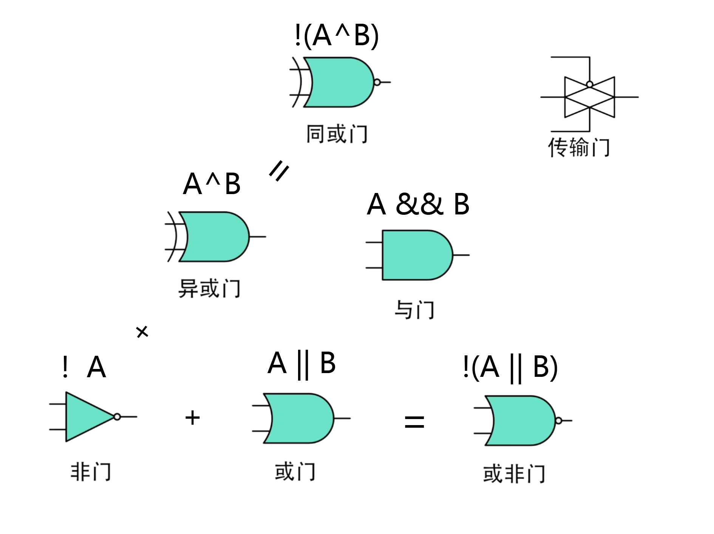

# 学习笔记 

*2024-3-30*

- ##  Markdown语法

> Markdown语法具有简洁高效, 多平台兼容, 可读性高等特点.<br>
> 使用Markdown语法有助于学习工作的记录等行为.

### 基础语法

#### 1. 标题-段落-格式：

1. 标题

```Markdown
# 一级标题
## 二级标题
### 三级标题
```

# 一级标题
## 二级标题
### 三级标题

2. 块引用

```Markdown
> 这是块引用
> > 这是块引用的块引用
```

> 这是块引用
> > 这是块引用的块引用

3. 换行
```Markdown
说完这句话就换行(2或多个空格后回车)
说完这句话就换行<br>return
```

说完这句话就换行  

说完这句话就换行<br>return

4. 强调格式

```Markdown
**粗体**  *斜体1*  _斜体2_  ***又粗又斜***  ~~这句话是错的~~
```

**粗体**  *斜体1*  _斜体2_  ***又粗又斜***  ~~这句话是错的~~ 

5. 分隔线 以下三种效果一样

```Markdown
---
***
___
```

***

**建议分隔线前后加上空白行**

#### 2. 内容

1. 列表:

有序列表数字打头<br>无序列表 -  +  * 打头

```Markdown
1. 这是:
	1. 有序 
	2. 列表
2. 这是:
	* 无序
	- 列
	+ 表
```

1. 这是:
	1. 有序 
	2. 列表
	
2. 这是:
	* 无序
	- 列
	
	+ 表  
---


2. 代码

通过三个反引号```来创建代码块  

两个反引号可以包裹行内代码``while(1)``

```C++
cout << 3.14;
```

3. 链接与图片  

```Markdown
[Markdown官方教程基本语法](https://markdown.com.cn/basic-syntax/links.html "Markdown链接语法")
```
[Markdown官方教程基本语法](https://markdown.com.cn/basic-syntax/links.html "Markdown链接语法")

```Markdown

```


- ## 问题导向Q&A  

### 1. 数字电路入门  

> - 嵌入式中常用的进制数与编码方式是什么?
>
> 	1. 在嵌入式系统中,二进制数的主要优势是什么?
> 	2. ASCII编码和Unicode编码的主要区别是什么？在嵌入式系统中,什么情况下可能会选择使用Unicode编码而不是ASCII编码?
> 	3. 假设你正在为一个嵌入式系统设计一个通信协议,这个协议需要能够传输多种语言的文本数据.你会选择哪种编码方式?为什么?

```Markdown
# 常用进制数
	- 二进制（Binary）: 嵌入式系统中最基本的数据类型,只有两个数码,0和1.
	- 十六进制（Hexadecimal）: 通常用于表示内存地址和机器指令.
# 编码方式
	- 字符编码：在嵌入式系统中,字符编码方式用于将英文字符和其他字符映射到二进制数.常用的字符编码方式包括ASCII（美国标准信息交换码）、UTF-8（8位Unicode转换格式）、UTF-16（16位Unicode转换格式）等.
	- 格雷码（Gray Code）: 是一种用于减少切换时误差的编码方式,也常用于硬件设计中.格雷码中,相邻的两个数值只有一位二进制数不同.
	- 二进制编码（Binary Encoding）: 在数字通信和数据存储中,原始数据可以被编码为二进制形式.例如,简单的非归零编码（NRZ）,高电平表示0,低电平表示1；或者相反.
	- 差分信号编码：例如差分信号传输（Differential Signaling）,用于提高信号的抗干扰能力.
	- 脉冲编码调制（PCM）：在数字通信中,模拟信号通常需要被采样并转换为二进制数,PCM是一种常用的数字信号编码方式.
	- 循环冗余校验（CRC）：虽然不是编码方式,但CRC是一种常用的错误检测码,用于检测数据在传输过程中是否发生错误.
```

---

```Markdown
# 1. 在嵌入式系统中,二进制数的主要优势体现在以下几个方面
	1. **简单的数学运算规则**：二进制数只有两个数码,0和1,因此数学运算规则非常简单.加法、减法、乘法和除法都遵循类似的十进制规则,但计算起来更加直接,因为只需要考虑两个状态.
	2. **硬件实现方便**：电子电路很容易区分高电平（通常表示为1）和低电平（通常表示为0).因此,二进制数非常适合用电子硬件来实现和处理.
	3. **高效的存储和传输**：二进制数占用的存储空间和传输带宽较少.例如,一个8位的二进制数可以表示256种不同的状态,而同样大小的十进制数需要10位.
	4. **逻辑操作直接**：逻辑门电路,如与门、或门、非门等,可以直接操作二进制数.这使得数字逻辑设计变得简单,并且可以构建复杂的计算系统.
	5. **易于进行位操作**：在嵌入式系统中,位操作是非常常见的,二进制数使得位操作（如位掩码、位移、位计数等）变得简单和直接.
	6. **适应计算机架构**：计算机内部的硬件,如CPU、内存和I/O设备,都是基于二进制信号设计的.因此,二进制数能够很好地适应计算机的架构和操作.
	7. **国际标准统一**：二进制数是国际上通用的标准,几乎所有的数字电子设备和系统都是基于二进制数进行设计和操作的.
# 2. ASCII & Unicode
	ASCII 码使用指定的7 位或8 位二进制数组合来表示128或256种可能的字符.标准ASCII码也叫基础ASCII码,使用7位二进制数（剩下的1位二进制为0）来表示所有的大写和小写字母,数字0 到9、标点符号, 以及在美式英语中使用的特殊控制字符.其中最后一位用于奇偶校验.
	Unicode把所有语言都统一到一套编码里,这样就不会再有乱码问题了.Unicode最常用的是用两个字节表示一个字符（如果要用到非常偏僻的字符,就需要4个字节）.现代操作系统和大多数编程语言都直接支持Unicode.
	当需要使用到多语言时,考虑使用Unicode编码.

# 3.  Unicode编码.Unicode编码适用于全球化的应用程序和多语言环境,它支持的国际化文本处理远远超出了ASCII编码的能力.
```

> - 数字逻辑门电路有哪些？
> 	1. 与门（AND Gate）在什么情况下输出为1？
> 	2. 或门（OR Gate）在什么情况下输出为0？
> 	3. 非门（NOT Gate）的功能是什么？

如图:



### 2. 模拟电路基础

> - 电阻、电容、电感、二极管、三极管分别是什么？
> 	1. 电阻在电路中的主要作用是什么？
> 	2. 电容的基本单位是什么？请描述一下电容的基本工作原理. 电感与电容在电路中的功能有何不同？
> 	3. 二极管的主要特点是什么？它在电路中通常用于什么功能?

```Markdown
- 电阻：电阻是电路中用来阻碍电流流动的元件.它根据欧姆定律,即电压和电流之间存在线性关系的原理工作.电阻的作用包括限制电流、分配电压、提供负载、调节电流强度等.电阻的单位是欧姆（Ω）.
- 电容：电容是一种能够存储电荷的电子元件,通常由两个导体（如金属板）和一个绝缘材料（电介质）组成.电容器能够在两个导体之间积累电荷,并且能够根据需要释放或吸收电能.电容的单位是法拉（F）,但在实际应用中常用微法（μF）或纳法（nF）来表示.
- 电感：电感是电路中用来阻碍电流变化（包括电流增加和减少）的元件,它由线圈或者任何能够产生磁场的形状构成.电感器能够储存能量在磁场中,并且对电流的变化产生反应.电感的单位是亨利（H）,在实际应用中,常用毫亨利（mH）或微亨利（μH）来表示.
- 二极管：二极管是一种半导体器件,具有一个P-N结,能够在一定方向上允许电流通过,而在反方向上则阻断电流.二极管的主要应用包括整流、调制、保护电路等.
- 三极管：三极管是一种半导体放大器或开关器件,它具有三个控制电流的端口：发射极、基极和集电极.三极管能够放大微小的电流信号,或者在数字电路中作为开关来使用.
```

---

```Markdown
1. 阻碍电流流动
2. F(法拉).通常一个电介质置于两个导体之间, 两个导体简可以积累电荷,并按需释放或吸收电能.
3. 二极管对电流具有单向导通作用.整流 调制 保护电路.
```
